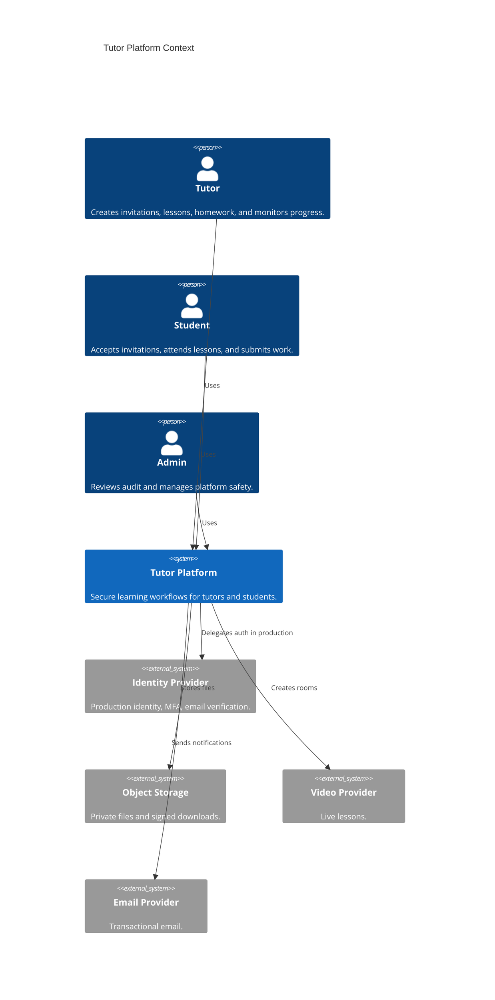

# System Context

```mermaid
C4Context
  title Tutor Platform Context
  Person(tutor, "Tutor", "Creates invitations, lessons, homework, and monitors progress.")
  Person(student, "Student", "Accepts invitations, attends lessons, and submits work.")
  Person(admin, "Admin", "Reviews audit and manages platform safety.")
  System(platform, "Tutor Platform", "Secure learning workflows for tutors and students.")
  System_Ext(identity, "Identity Provider", "Production identity, MFA, email verification.")
  System_Ext(storage, "Object Storage", "Private files and signed downloads.")
  System_Ext(video, "Video Provider", "Live lessons.")
  System_Ext(email, "Email Provider", "Transactional email.")
  Rel(tutor, platform, "Uses")
  Rel(student, platform, "Uses")
  Rel(admin, platform, "Uses")
  Rel(platform, identity, "Delegates auth in production")
  Rel(platform, storage, "Stores files")
  Rel(platform, video, "Creates rooms")
  Rel(platform, email, "Sends notifications")
```

