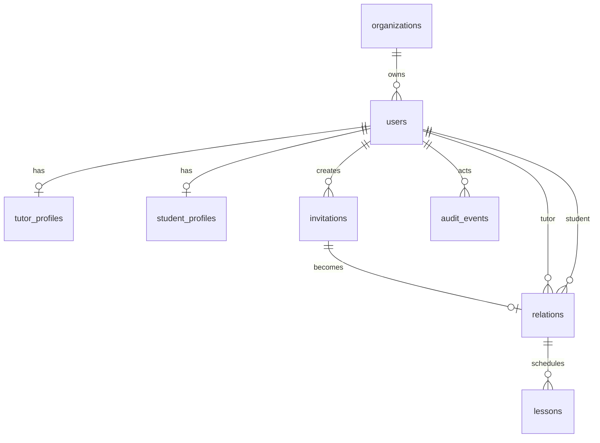

# Data Model

Phase 1 tables:

- `organizations`
- `users`
- `tutor_profiles`
- `student_profiles`
- `invitations`
- `relations`
- `lessons`
- `audit_events`

Server-owned fields include organization, role, ownership, creator, and state transitions. Clients submit only workflow input.

