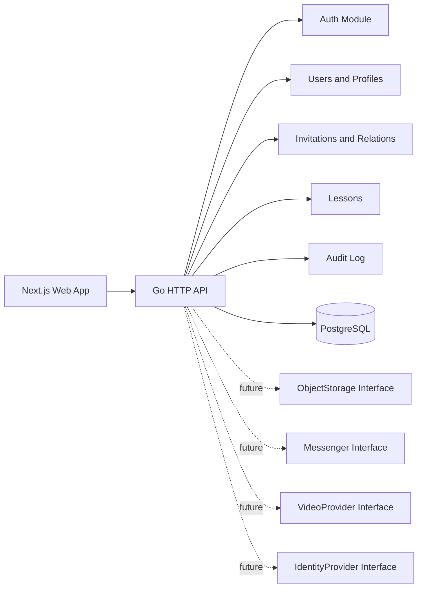
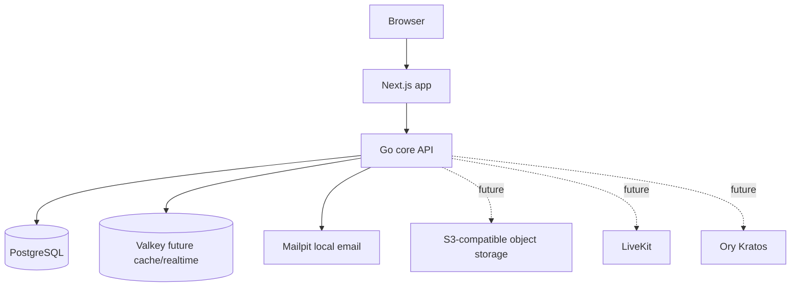
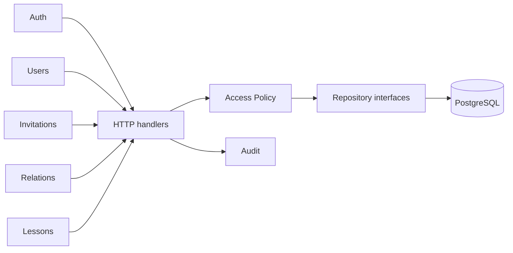

# Architecture Overview

The platform starts as a modular monolith. Business modules share one deployment unit but expose explicit service boundaries and avoid direct access to each other's private data.

## Containers

## Module Boundaries

