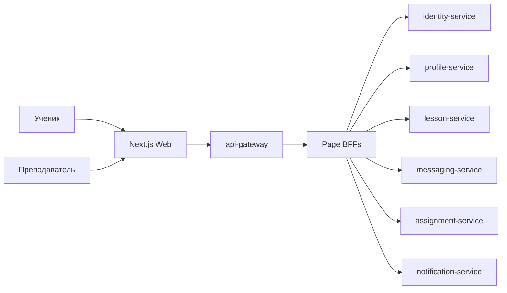
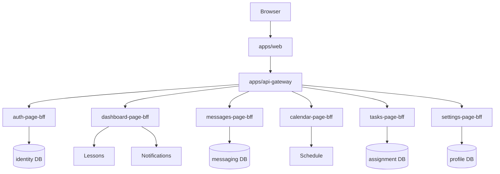

# V2 Microservices Architecture

The current runnable slice uses `services/core` as a compatibility core. The target architecture is service-owned data plus page-BFF aggregation. Migration follows strangler pattern: keep user journeys working, move one bounded context at a time, then retire compatibility endpoints after contract and data migration tests pass.

## C4 Context

## Containers

## Data Ownership

| Service | Owns | Does not own |
| --- | --- | --- |
| identity-service | identities, credentials, sessions | profile preferences |
| profile-service | display name, avatar, timezone, locale | credentials, role |
| relationships-service | invitations, tutor-student links | lessons, messages |
| lesson-service | lessons and lesson policy | calendar availability |
| schedule-service | calendar events, availability, reschedule records | assignment deadlines |
| messaging-service | conversations, messages, receipts | file blobs |
| assignment-service | assignments, submissions, grading | notification delivery |
| notification-service | notification inbox and delivery preferences | source domain status |
| file-service | file metadata, grants, signed URLs | message or assignment body |
| audit-service | immutable audit trail | domain operational data |

## Compatibility

`services/core` currently owns all runnable tables. It is explicitly temporary. New service migrations must use expand/migrate/contract and opaque IDs. Cross-service joins and foreign keys are forbidden once a bounded context leaves `core`.

