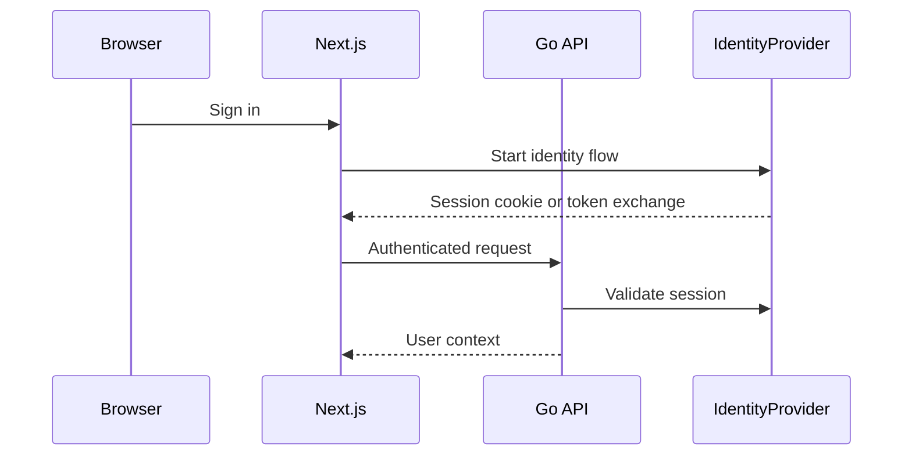
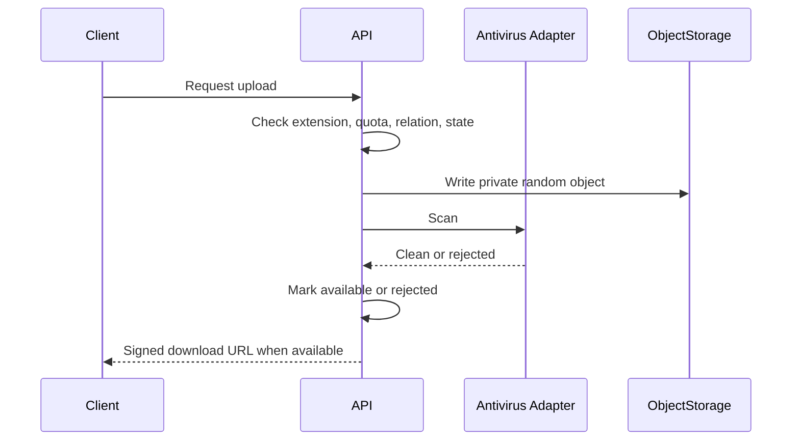
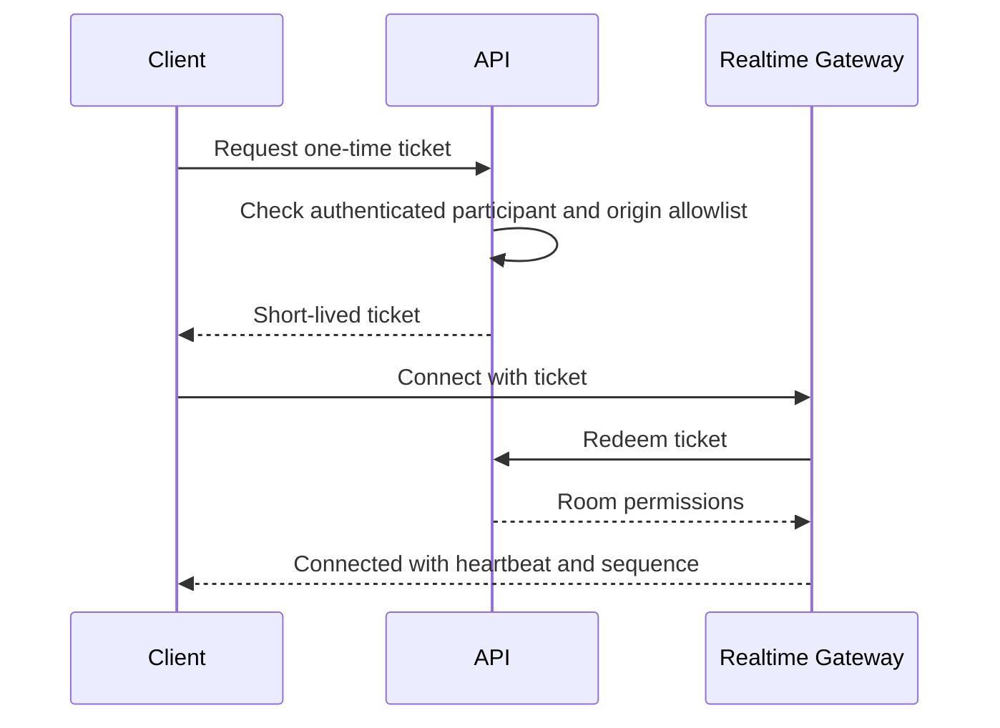

# Threat Model

## Assets

- Minor student personal data.
- Tutor-student relationship graph.
- Lesson metadata and future files/chat/video records.
- Authentication sessions and audit trail.

## Controls

- Deny-by-default authorization.
- Tenant checks on every protected endpoint.
- Participant checks before relation or lesson access.
- Server-owned role and organization assignment.
- Parameterized SQL through pgx.
- Security headers, CORS allowlist, request IDs, and structured logs.
- Audit events for invitations, relation acceptance, and lessons.

## Authentication Flow

Phase 1 replaces the IdP with a development-only provider that trusts local headers and is blocked in production.

## File Upload Flow

## WebSocket Connection Flow

## Residual Risks

- Production identity, MFA, email verification, and refresh-token rotation are not implemented in Phase 1.
- File scanning, WebSocket tickets, and video rooms are architectural placeholders until later phases.
- Legal privacy review is required before serving minors in production.

